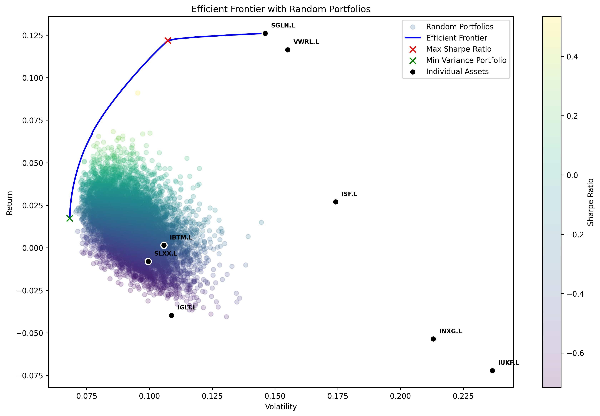
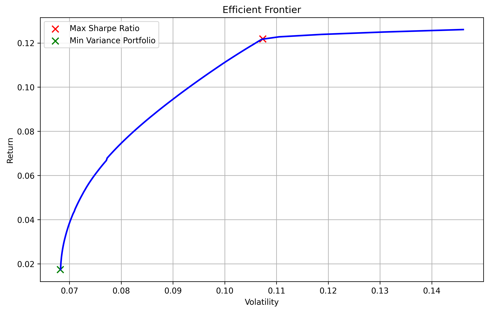
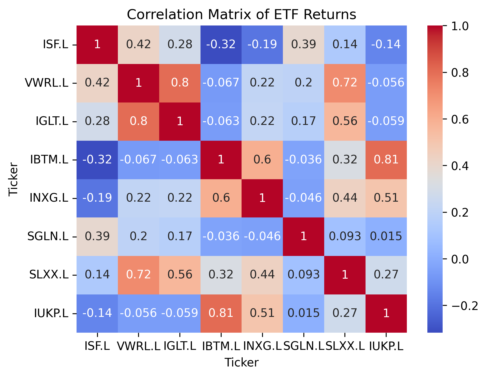

# Portfolio Optimiser

A Python implementation of Markowitz mean-variance optimisation applied to a UK multi-asset universe. Computes the efficient frontier, maximum Sharpe ratio portfolio, and minimum variance portfolio from five years of daily price data.



## About this project

I'm a first-year economics student interested in quantitative finance. I wanted to build something that connected the portfolio theory we cover in lectures to actual market data, rather than just working through textbook examples with made-up numbers.

The concept itself is simple: given a set of assets, what's the best way to split your money between them? Markowitz's framework answers this by trading off expected return against variance, producing an "efficient frontier" of optimal portfolios.

## Universe

Eight London-listed ETFs across five asset classes:

- **ISF.L** — UK equities (FTSE 100)
- **VWRL.L** — Global equities
- **IGLT.L** — UK gilts
- **IBTM.L** — US treasuries
- **INXG.L** — Inflation-linked gilts
- **SGLN.L** — Gold
- **SLXX.L** — UK corporate bonds
- **IUKP.L** — UK property

Five years of daily prices (2020–2025) via yfinance.

## Method

- Daily returns annualised by 252 trading days
- Mean returns and covariance matrix estimated from sample
- 10,000 random portfolios generated
- Optimisation via `scipy.optimize.minimize` (SLSQP) (least squares)
- Constraints: weights sum to 1, no shorting (0 ≤ w ≤ 1)
- Risk-free rate: 4% (UK 3-month gilt yield)
- Efficient frontier traced by solving 100 constrained optimisations for target returns



## Correlation structure



- Gold (SGLN.L) is the strongest diversifier — max correlation of 0.39 with any other asset
- US treasuries and UK property correlated at 0.81 — both hit by 2022 rate hikes
- Global equities and UK gilts at 0.80 — unusually high, broken by the 2022 inflation shock

## Results

|                       |  Equal Weight  |  Max Sharpe  |  Min Variance  |
|:----------------------|----------------|--------------|----------------|
| Annualised Return     |         0.0122 |       0.1218 |         0.0174 |
| Annualised Volatility |         0.0887 |       0.1073 |         0.0682 |
| Sharpe Ratio          |        -0.3136 |       0.7625 |        -0.3314 |

Optimisation moved Sharpe from -0.31 (equal weight) to 0.76 (max Sharpe).

### Weights

| Asset    | Equal Weight | Max Sharpe | Min Variance |
|----------|--------------|------------|--------------|
| ISF.L    | 0.125        | 0.000      | 0.152        |
| VWRL.L   | 0.125        | 0.439      | 0.070        |
| IGLT.L   | 0.125        | 0.000      | 0.107        |
| IBTM.L   | 0.125        | 0.000      | 0.405        |
| INXG.L   | 0.125        | 0.000      | 0.000        |
| SGLN.L   | 0.125        | 0.561      | 0.082        |
| SLXX.L   | 0.125        | 0.000      | 0.185        |
| IUKP.L   | 0.125        | 0.000      | 0.000        |

- **Max Sharpe**: concentrated in gold + global equities (low mutual correlation)
- **Min Variance**: spread across 7 of 8 assets

## Key takeaway

Max Sharpe puts 100% into two assets which seems counterintuitive. The optimiser exploits noise in historical estimates, not just signal. In practice you'd add max-weight constraints or use shrinkage estimators to fix this.

## Limitations

- **Estimation error** — historical returns are poor predictors of the future; optimiser is highly sensitive to inputs
- **Unusual sample** — covers Covid, fastest Fed hiking cycle in 40 years, UK gilt crisis
- **No transaction costs** — assumes frictionless rebalancing

## Possible extensions

- Out-of-sample backtest (fit 2020–2023, test 2024)
- Capital Market Line from risk-free rate
- Max-weight constraints to force diversification
- Allow borrowing

## Run it

```bash
git clone https://github.com/poggey/portfolio-optimiser.git
cd portfolio-optimiser
python3 -m venv .venv
source .venv/bin/activate
pip install -r requirements.txt
jupyter notebook notebook.ipynb
```

## Stack

Python 3.13 · pandas · numpy · scipy · matplotlib · seaborn · yfinance
